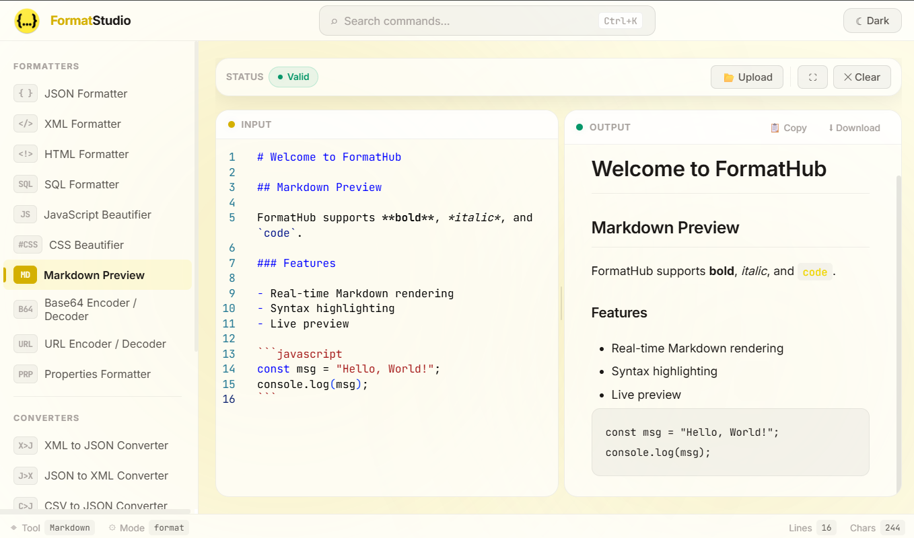

# FormatHub

A browser-based code formatter, converter, and validator — format, minify, convert, and diff code in multiple languages right in your browser. No server needed.

**[Launch FormatHub →](https://format-hub-mu.vercel.app/)**



## Features

- **Formatters**: JSON, XML, HTML, SQL, CSS, JavaScript, Markdown, Base64, URL, YAML, CSV, Properties
- **Format & Minify**: Toggle between formatted output and minified/compressed versions for supported formats
- **Converters**: XML ↔ JSON, CSV ↔ JSON, YAML ↔ JSON, Properties → YAML
- **Diff tool**: Side-by-side file comparison
- **SQL dialect support**: MySQL, PostgreSQL, Oracle, SQL Server
- **Encode/Decode**: Base64 and URL encode/decode modes
- **Real-time validation**: Syntax errors highlighted inline with descriptive messages
- **Monaco editor**: Powered by the same engine as VS Code — syntax highlighting, line numbers, and more
- **Dark & light themes**: Persistent theme preference
- **Fully client-side**: All processing happens in-browser

## Tech Stack

| Layer | Technology |
|-------|-----------|
| Framework | React 19 |
| Language | TypeScript (strict mode) |
| Build | Vite 8 |
| Editor | Monaco Editor (via @monaco-editor/react) |
| Formatting | Prettier, sql-formatter, xml-formatter, js-yaml |
| Markdown | marked |
| Validation | Custom validators + DOMParser |
| Styling | CSS with CSS variables for theming |

## Getting Started

```bash
npm install
npm run dev
```

Open `http://localhost:5173` in your browser.

## Available Commands

| Command | Description |
|---------|-------------|
| `npm run dev` | Start development server |
| `npm run build` | Type-check and build for production |
| `npm run lint` | Run ESLint |
| `npm run preview` | Preview production build |

## Architecture

```
src/
  types/index.ts         # Format, converter, and nav definitions
  engines/
    formatters.ts        # All format/minify/encode logic
    converters.ts        # Cross-format conversion logic
    validators.ts        # Per-format validation
    detector.ts          # Auto-detection of data format
  hooks/
    useFormatter.ts      # Core state management
    useTheme.ts          # Theme persistence
  components/
    Layout/              # Header, Sidebar, Breadcrumb
    ToolPage/            # Main formatter/converter editor view
    DiffView/            # Side-by-side file diff component
    Background.tsx       # Animated background effects
    CommandPalette.tsx   # Quick tool switcher
    CustomSelect.tsx     # Styled select dropdown
    Footer/              # Site footer
```

Adding a new format requires updating `FORMATS` in `src/types/index.ts`, adding a case in `formatters.ts`, and adding a validator in `validators.ts`.
